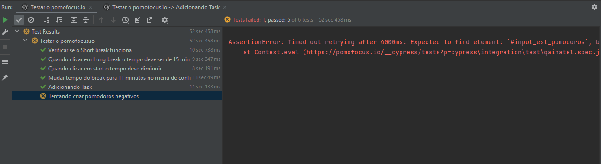

# S206 - Qualidade de Software Teste de UI

Para realizar os testes eu utilizei o cypress.io, que é um framework de testes de UI.

## Instalação do ambiente de desenvolvimento:

1. Git Bash (Git for Windows - mais leve)
https://gitforwindows.org/

2. Nodejs (node):
https://nodejs.org/en/

3. IteliJ IDEA (IDE):
https://www.jetbrains.com/idea/

4. Instalar o plugin Cypress no IntelliJ

5. Com tudo instalado é só abrir o cypress/integration/test/qainatel.spec.js e rodar usando o plugin Cypress.
obs: O plugin já gera automaticamente o HTML do teste e também o video do teste.

